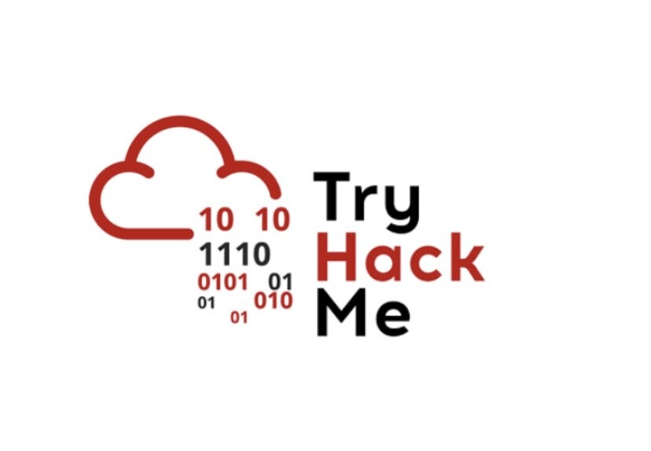
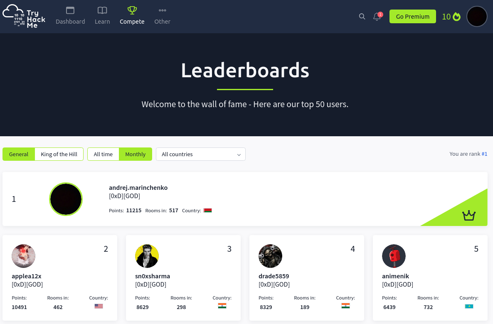

  
  
  
  
  
  
  
  
  

# From Zero to God Tryhackme Free
### От нуля до бога tryhackme бесплатно 

TryHackMe — это исключительная онлайн-платформа, разработанная для предоставления людям практического опыта обучения 
кибербезопасности.
Она предлагает иммерсивную среду, в которой пользователи могут изучать различные темы, осваивать основные 
инструменты и улучшать свои практические навыки. 

## Let's start with the information rooms, they will give us the necessary base:
#### Начнем с информационных комнат, они нам дадут необходимую базу:
- [Advent of Cyber '23 Side Quest](https://github.com/BEPb/tryhackme/blob/master/00.info/Advent%20of%20Cyber%20'23%20Side%20Quest.md)
- [Baron Samedit](https://github.com/BEPb/tryhackme/blob/master/00.info/Baron%20Samedit.md)
- [Burp Suite: Repeater](https://github.com/BEPb/tryhackme/blob/master/00.info/Burp%20Suite%20Repeater.md)
- [Bypass Disable Functions](https://github.com/BEPb/tryhackme/blob/master/00.info/Bypass%20Disable%20Functions.md)
- [CVE-2021-41773/42013](https://github.com/BEPb/tryhackme/blob/master/00.info/CVE-2021-41773%2042013.md)
- [Careers in Cyber](https://github.com/BEPb/tryhackme/blob/master/00.info/Careers%20in%20Cyber.md)
- [Dirty Pipe: CVE-2022-0847](https://github.com/BEPb/tryhackme/blob/master/00.info/Dirty%20Pipe%20CVE-2022-0847.md)
- [History of Malware](https://github.com/BEPb/tryhackme/blob/master/00.info/History%20of%20Malware.md)
- [Intro to IR and IM](https://github.com/BEPb/tryhackme/blob/master/00.info/Intro%20to%20IR%20and%20IM.md) 
- [Learn & win prizes - Fall 2022](https://github.com/BEPb/tryhackme/blob/master/00.info/Learn%20%26%20win%20prizes%20-%20Fall%202022.md)
- [Learn and win prizes #2](https://github.com/BEPb/tryhackme/blob/master/00.info/Learn%20and%20win%20prizes%20%232.md)
- [Learn and win prizes](https://github.com/BEPb/tryhackme/blob/master/00.info/Learn%20and%20win%20prizes.md)
- [Linux Fundamentals Part 1](https://github.com/BEPb/tryhackme/blob/master/00.info/Linux%20Fundamentals%20Part%201.md)
- [OverlayFS - CVE-2021-3493](https://github.com/BEPb/tryhackme/blob/master/00.info/OverlayFS%20-%20CVE-2021-3493.md)
- [Polkit: CVE-2021-3560](https://github.com/BEPb/tryhackme/blob/master/00.info/Polkit%20CVE-2021-3560.md)
- [Pwnkit: CVE-2021-4034](https://github.com/BEPb/tryhackme/blob/master/00.info/Pwnkit%20CVE-2021-4034.md)
- [REmux The Tmux](https://github.com/BEPb/tryhackme/blob/master/00.info/REmux%20The%20Tmux.md)
- [Security Awareness](https://github.com/BEPb/tryhackme/blob/master/00.info/Security%20Awareness.md)
- [Spring4Shell: CVE-2022-22965](https://github.com/BEPb/tryhackme/blob/master/00.info/Spring4Shell%20CVE-2022-22965.md)
- [Sudo Buffer Overflow](https://github.com/BEPb/tryhackme/blob/master/00.info/Sudo%20Buffer%20Overflow.md)
- [Sudo Security Bypass](https://github.com/BEPb/tryhackme/blob/master/00.info/Sudo%20Security%20Bypass.md)
- [What is Networking?](https://github.com/BEPb/tryhackme/blob/master/00.info/What%20is%20Networking.md)
- [Win Prizes and Learn - 2023!](https://github.com/BEPb/tryhackme/blob/master/00.info/Win%20Prizes%20and%20Learn%20-%202023!.md)
- [Windows Fundamentals 2](https://github.com/BEPb/tryhackme/blob/master/00.info/Windows%20Fundamentals%202.md)
- [Windows Fundamentals 3](https://github.com/BEPb/tryhackme/blob/master/00.info/Windows%20Fundamentals%203.md)
- [TryWinMe: Think Cyber Monopoly](https://github.com/BEPb/tryhackme/blob/master/00.info/TryWinMe%20Think%20Cyber%20Monopoly.md)

## Easy rooms:
#### Простые комнаты:
- [Publisher](https://github.com/BEPb/tryhackme/blob/master/01.easy/Publisher/Publisher.md)
- [Linux File System Analysis](https://github.com/BEPb/tryhackme/blob/master/01.easy/Linux%20File%20System%20Analysis.md)
- [Moniker Link (CVE-2024-21413)](https://github.com/BEPb/tryhackme/blob/master/01.easy/Moniker%20Link%20(CVE-2024-21413).md)
- [Intro to IaC](https://github.com/BEPb/tryhackme/blob/master/01.easy/Intro%20to%20IaC.md)
- [Eviction](https://github.com/BEPb/tryhackme/blob/master/01.easy/Eviction.md)
- [HTTP Request Smuggling](https://github.com/BEPb/tryhackme/blob/master/01.easy/HTTP%20Request%20Smuggling.md)
- [Metasploit: Introduction](https://github.com/BEPb/tryhackme/blob/master/01.easy/Metasploit%20Introduction.md)
- [Kenobi](https://github.com/BEPb/tryhackme/blob/master/01.easy/Kenobi.md)
- [RootMe](https://github.com/BEPb/tryhackme/blob/master/01.easy/RootMe.md)
- [Network Services 2](https://github.com/BEPb/tryhackme/blob/master/01.easy/Network%20Services%202.md)
- [Google Dorking](https://github.com/BEPb/tryhackme/blob/master/01.easy/Google%20Dorking.md)
- [Simple CTF](https://github.com/BEPb/tryhackme/blob/master/01.easy/Simple%20CTF/Simple%20CTF.md)
- [Intro to Digital Forensics](https://github.com/BEPb/tryhackme/blob/master/01.easy/Intro%20to%20Digital%20Forensics.md)
- [Hydra](https://github.com/BEPb/tryhackme/blob/master/01.easy/Hydra.md)
- [OWASP Juice Shop](https://github.com/BEPb/tryhackme/blob/master/01.easy/OWASP%20Juice%20Shop.md)
- [OhSINT](https://github.com/BEPb/tryhackme/blob/master/01.easy/OhSINT.md)
- [Passive Reconnaissance](https://github.com/BEPb/tryhackme/blob/master/01.easy/Passive%20Reconnaissance.md)
- [Pyramid Of Pain](https://github.com/BEPb/tryhackme/blob/master/01.easy/Pyramid%20Of%20Pain.md)
- [Python Basics](https://github.com/BEPb/tryhackme/blob/master/01.easy/Python%20Basics.md)
- [Intro to Offensive Security](https://github.com/BEPb/tryhackme/blob/master/01.easy/Intro%20to%20Offensive%20Security.md)
- [Nmap](https://github.com/BEPb/tryhackme/blob/master/01.easy/Nmap.md)
- [Learning Cyber Security](https://github.com/BEPb/tryhackme/blob/master/01.easy/Learning%20Cyber%20Security.md)
- [Pentesting Fundamentals](https://github.com/BEPb/tryhackme/blob/master/01.easy/Pentesting%20Fundamentals.md)
- [Intro to Defensive Security](https://github.com/BEPb/tryhackme/blob/master/01.easy/Intro%20to%20Defensive%20Security.md)
- [Advent of Cyber 2022](https://github.com/BEPb/tryhackme/blob/master/01.easy/Advent%20of%20Cyber%202022.md)
- [OpenVPN](https://github.com/BEPb/tryhackme/blob/master/01.easy/OpenVPN.md)
- [Introductory Researching](https://github.com/BEPb/tryhackme/blob/master/01.easy/Introductory%20Researching.md)
- [Vulnversity](https://github.com/BEPb/tryhackme/blob/master/01.easy/Vulnversity.md)
- [Basic Pentesting](https://github.com/BEPb/tryhackme/blob/master/01.easy/Basic%20Pentesting.md)
- [Advent of Cyber 3 (2021)](https://github.com/BEPb/tryhackme/blob/master/01.easy/Advent%20of%20Cyber%203%20(2021).md)
- [Web Application Security](https://github.com/BEPb/tryhackme/blob/master/01.easy/Web%20Application%20Security.md)
- [Starting Out In Cyber Sec](https://github.com/BEPb/tryhackme/blob/master/01.easy/Starting%20Out%20In%20Cyber%20Sec.md)
- [DNS in detail](https://github.com/BEPb/tryhackme/blob/master/01.easy/DNS%20in%20detail.md)
- [OWASP Top 10](https://github.com/BEPb/tryhackme/blob/master/01.easy/OWASP%20Top%2010.md)
- [Blue](https://github.com/BEPb/tryhackme/blob/master/01.easy/Blue.md)
- [Advent of Cyber 2023](https://github.com/BEPb/tryhackme/blob/master/01.easy/Advent%20of%20Cyber%202023.md)
- [Linux Strength Training](https://github.com/BEPb/tryhackme/blob/master/01.easy/Linux%20Strength%20Training.md)
- [Junior Security Analyst Intro](https://github.com/BEPb/tryhackme/blob/master/01.easy/Junior%20Security%20Analyst%20Intro.md)
- [Pickle Rick](https://github.com/BEPb/tryhackme/blob/master/01.easy/Pickle%20Rick.md)
- [Red Team Fundamentals](https://github.com/BEPb/tryhackme/blob/master/01.easy/Red%20Team%20Fundamentals.md)
- [Network Services](https://github.com/BEPb/tryhackme/blob/master/01.easy/Network%20Services.md)
- [Advent of Cyber 2 [2020]](https://github.com/BEPb/tryhackme/blob/master/01.easy/Advent%20of%20Cyber%202%20%5B2020%5D.md)
- [HTTP in Detail](https://github.com/BEPb/tryhackme/blob/master/01.easy/HTTP%20in%20Detail.md)
- [Active Directory Basics](https://github.com/BEPb/tryhackme/blob/master/01.easy/Active%20Directory%20Basics.md)
- [Bounty Hacker](https://github.com/BEPb/tryhackme/blob/master/01.easy/Bounty%20Hacker.md)
- [Agent Sudo](https://github.com/BEPb/tryhackme/blob/master/01.easy/Agent%20Sudo.md)
- [Putting it all together](https://github.com/BEPb/tryhackme/blob/master/01.easy/Putting%20it%20all%20together.md)
- [Red Team Engagements](https://github.com/BEPb/tryhackme/blob/master/01.easy/Red%20Team%20Engagements.md)
- [How Websites Work](https://github.com/BEPb/tryhackme/blob/master/01.easy/How%20Websites%20Work.md)
- [Crack the hash](https://github.com/BEPb/tryhackme/blob/master/01.easy/Crack%20the%20hash.md)
- [Nessus](https://github.com/BEPb/tryhackme/blob/master/01.easy/Nessus.md)
- [Overpass 2 - Hacked](https://github.com/BEPb/tryhackme/blob/master/01.easy/Overpass%202%20-%20Hacked.md)
- [Active Reconnaissance](https://github.com/BEPb/tryhackme/blob/master/01.easy/Active%20Reconnaissance.md)
- [SQL Injection Lab](https://github.com/BEPb/tryhackme/blob/master/01.easy/SQL%20Injection%20Lab.md)
- [Cyber Kill Chain](https://github.com/BEPb/tryhackme/blob/master/01.easy/Cyber%20Kill%20Chain.md)
- [Overpass](https://github.com/BEPb/tryhackme/blob/master/01.easy/Overpass.md)
- [Vulnerabilities 101](https://github.com/BEPb/tryhackme/blob/master/01.easy/Vulnerabilities%20101.md)
- [MAL: Malware Introductory](https://github.com/BEPb/tryhackme/blob/master/01.easy/MAL%20Malware%20Introductory.md)
- [LazyAdmin](https://github.com/BEPb/tryhackme/blob/master/01.easy/LazyAdmin.md)
- [c4ptur3-th3-fl4g](https://github.com/BEPb/tryhackme/blob/master/01.easy/c4ptur3-th3-fl4g.md)
- [Bash Scripting](https://github.com/BEPb/tryhackme/blob/master/01.easy/Bash%20Scripting.md)
- [Investigating Windows](https://github.com/BEPb/tryhackme/blob/master/01.easy/Investigating%20Windows.md)
- [Buffer Overflow Prep](https://github.com/BEPb/tryhackme/blob/master/01.easy/Buffer%20Overflow%20Prep.md)
- [Advent of Cyber 1 [2019]](https://github.com/BEPb/tryhackme/blob/master/01.easy/Advent%20of%20Cyber%201%20%5B2019%5D.md)
- [Phishing Analysis Fundamentals](https://github.com/BEPb/tryhackme/blob/master/01.easy/Phishing%20Analysis%20Fundamentals.md)
- [Startup](https://github.com/BEPb/tryhackme/blob/master/01.easy/Startup.md)
- [Post-Exploitation Basics](https://github.com/BEPb/tryhackme/blob/master/01.easy/Post-Exploitation%20Basics.md)
- [Cyborg](https://github.com/BEPb/tryhackme/blob/master/01.easy/Cyborg.md)
- [tomghost](https://github.com/BEPb/tryhackme/blob/master/01.easy/tomghost.md)
- [Become a Hacker](https://github.com/BEPb/tryhackme/blob/master/01.easy/Become%20a%20Hacker.md)
- [Brooklyn Nine Nine](https://github.com/BEPb/tryhackme/blob/master/01.easy/Brooklyn%20Nine%20Nine.md)
- [Ignite](https://github.com/BEPb/tryhackme/blob/master/01.easy/Ignite.md)
- [Intro to Cyber Threat Intel](https://github.com/BEPb/tryhackme/blob/master/01.easy/Intro%20to%20Cyber%20Threat%20Intel.md)
- [Security Engineer Intro](https://github.com/BEPb/tryhackme/blob/master/01.easy/Security%20Engineer%20Intro.md)
- [Threat Intelligence Tools](https://github.com/BEPb/tryhackme/blob/master/01.easy/Threat%20Intelligence%20Tools.md)
- [Wgel CTF](https://github.com/BEPb/tryhackme/blob/master/01.easy/Wgel%20CTF.md)
- [Brute It](https://github.com/BEPb/tryhackme/blob/master/01.easy/Brute%20It.md)
- [Unified Kill Chain](https://github.com/BEPb/tryhackme/blob/master/01.easy/Unified%20Kill%20Chain.md)
- [Wifi Hacking 101](https://github.com/BEPb/tryhackme/blob/master/01.easy/Wifi%20Hacking%20101.md)
- [Year of the Rabbit](https://github.com/BEPb/tryhackme/blob/master/01.easy/Year%20of%20the%20Rabbit.md)
- [Anthem](https://github.com/BEPb/tryhackme/blob/master/01.easy/Anthem.md)
- [CTF collection Vol.1](https://github.com/BEPb/tryhackme/blob/master/01.easy/CTF%20collection%20Vol1/CTF%20collection%20Vol.1.md)
- [CTF collection Vol.2](https://github.com/BEPb/tryhackme/blob/master/01.easy/CTF%20collection%20Vol2/CTF%20collection%20Vol.2.md)
- [h4cked](https://github.com/BEPb/tryhackme/blob/master/01.easy/h4cked.md)
- [tmux](https://github.com/BEPb/tryhackme/blob/master/01.easy/tmux.md)
- [Lian_Yu](https://github.com/BEPb/tryhackme/blob/master/01.easy/Lian_Yu.md)
- [Chill Hack](https://github.com/BEPb/tryhackme/blob/master/01.easy/Chill%20Hack.md)
- [Introduction to SIEM](https://github.com/BEPb/tryhackme/blob/master/01.easy/Introduction%20to%20SIEM.md)
- [Blaster](https://github.com/BEPb/tryhackme/blob/master/01.easy/Blaster.md)
- [Security Principles](https://github.com/BEPb/tryhackme/blob/master/01.easy/Security%20Principles.md)
- [Searchlight - IMINT](https://github.com/BEPb/tryhackme/blob/master/01.easy/Security%20Principles.md)
- [Bolt](https://github.com/BEPb/tryhackme/blob/master/01.easy/Bolt.md)
- [Cryptography for Dummies](https://github.com/BEPb/tryhackme/blob/master/01.easy/Cryptography%20for%20Dummies.md)
- [Introduction to Django](https://github.com/BEPb/tryhackme/blob/master/01.easy/Introduction%20to%20Django.md)
- [GamingServer](https://github.com/BEPb/tryhackme/blob/master/01.easy/GamingServer.md)
- [Chocolate Factory](https://github.com/BEPb/tryhackme/blob/master/01.easy/Chocolate%20Factory.md)
- [Welcome](https://github.com/BEPb/tryhackme/blob/master/01.easy/Welcome.md)
- [The Cod Caper](https://github.com/BEPb/tryhackme/blob/master/01.easy/The%20Cod%20Caper.md)
- [Source](https://github.com/BEPb/tryhackme/blob/master/01.easy/Source.md)
- [Fowsniff CTF](https://github.com/BEPb/tryhackme/blob/master/01.easy/Fowsniff%20CTF.md)
- [DFIR: An Introduction](https://github.com/BEPb/tryhackme/blob/master/01.easy/DFIR%20An%20Introduction.md)
- [Introduction to OWASP ZAP](https://github.com/BEPb/tryhackme/blob/master/01.easy/Introduction%20to%20OWASP%20ZAP.md)
- [Phishing Emails in Action](https://github.com/BEPb/tryhackme/blob/master/01.easy/Phishing%20Emails%20in%20Action.md)
- [Easy Peasy](https://github.com/BEPb/tryhackme/blob/master/01.easy/Easy%20Peasy.md)
- [Traffic Analysis Essentials](https://github.com/BEPb/tryhackme/blob/master/01.easy/Traffic%20Analysis%20Essentials.md)
- [Governance & Regulation](https://github.com/BEPb/tryhackme/blob/master/01.easy/Governance%20%26%20Regulation.md)
- [Intro to Endpoint Security](https://github.com/BEPb/tryhackme/blob/master/01.easy/Intro%20to%20Endpoint%20Security.md)
- [The Hacker Methodology](https://github.com/BEPb/tryhackme/blob/master/01.easy/The%20Hacker%20Methodology.md)
- [Intro to Containerisation](https://github.com/BEPb/tryhackme/blob/master/01.easy/Intro%20to%20Containerisation.md)
- [OpenVAS](https://github.com/BEPb/tryhackme/blob/master/01.easy/OpenVAS.md)
- [Sakura Room](https://github.com/BEPb/tryhackme/blob/master/01.easy/Sakura%20Room.md)
- [Linux Modules](https://github.com/BEPb/tryhackme/blob/master/01.easy/Linux%20Modules.md)
- [WebOSINT](https://github.com/BEPb/tryhackme/blob/master/01.easy/WebOSINT.md)
- [Reversing ELF](https://github.com/BEPb/tryhackme/blob/master/01.easy/Reversing%20ELF.md)
- [Archangel](https://github.com/BEPb/tryhackme/blob/master/01.easy/Archangel.md)
- [ffuf](https://github.com/BEPb/tryhackme/blob/master/01.easy/ffuf.md)
- [ColddBox: Easy](https://github.com/BEPb/tryhackme/blob/master/01.easy/ColddBox%20Easy.md)
- [Tor](https://github.com/BEPb/tryhackme/blob/master/01.easy/Tor.md)
- [Shodan.io](https://github.com/BEPb/tryhackme/blob/master/01.easy/Shodan.io.md)
- [Git Happens](https://github.com/BEPb/tryhackme/blob/master/01.easy/Git%20Happens.md)
- [Agent T](https://github.com/BEPb/tryhackme/blob/master/01.easy/Agent%20T.md)
- [Toolbox: Vim](https://github.com/BEPb/tryhackme/blob/master/01.easy/Toolbox%20Vim.md)
- [Linux Backdoors](https://github.com/BEPb/tryhackme/blob/master/01.easy/Linux%20Backdoors.md)
- [Geolocating Images](https://github.com/BEPb/tryhackme/blob/master/01.easy/Geolocating%20Images.md)
- [Intro to Docker](https://github.com/BEPb/tryhackme/blob/master/01.easy/Intro%20to%20Docker.md)
- [Mustacchio](https://github.com/BEPb/tryhackme/blob/master/01.easy/Mustacchio.md)
- [Blueprint](https://github.com/BEPb/tryhackme/blob/master/01.easy/Blueprint.md)
- [Introduction to Antivirus](https://github.com/BEPb/tryhackme/blob/master/01.easy/Introduction%20to%20Antivirus.md)
- [Corridor](https://github.com/BEPb/tryhackme/blob/master/01.easy/Corridor.md)
- [Identity and Access Management](https://github.com/BEPb/tryhackme/blob/master/01.easy/Identity%20and%20Access%20Management.md)
- [Smag Grotto](https://github.com/BEPb/tryhackme/blob/master/01.easy/Smag%20Grotto.md)
- [Tech_Supp0rt: 1](https://github.com/BEPb/tryhackme/blob/master/01.easy/Tech_Supp0rt%201.md)
- [JavaScript Basics](https://github.com/BEPb/tryhackme/blob/master/01.easy/JavaScript%20Basics.md)
- [Juicy Details](https://github.com/BEPb/tryhackme/blob/master/01.easy/Juicy%20Details.md)
- [Introduction to Windows API](https://github.com/BEPb/tryhackme/blob/master/01.easy/Introduction%20to%20Windows%20API.md)
- [Ninja Skills](https://github.com/BEPb/tryhackme/blob/master/01.easy/Ninja%20Skills.md)
- [Gallery](https://github.com/BEPb/tryhackme/blob/master/01.easy/Gallery.md)
- [kiba](https://github.com/BEPb/tryhackme/blob/master/01.easy/kiba.md)
- [Team](https://github.com/BEPb/tryhackme/blob/master/01.easy/Team.md)
- [Intro to Logs](https://github.com/BEPb/tryhackme/blob/master/01.easy/Intro%20to%20Logs.md)
- [All in One](https://github.com/BEPb/tryhackme/blob/master/01.easy/All%20in%20One.md)
- [Getting Started](https://github.com/BEPb/tryhackme/blob/master/01.easy/Getting%20Started.md)
- [Empire](https://github.com/BEPb/tryhackme/blob/master/01.easy/Empire.md)
- [VulnNet: Internal](https://github.com/BEPb/tryhackme/blob/master/01.easy/VulnNet%20Internal.md)
- [Badbyte](https://github.com/BEPb/tryhackme/blob/master/01.easy/Badbyte.md)
- [x86 Architecture Overview](https://github.com/BEPb/tryhackme/blob/master/01.easy/x86%20Architecture%20Overview.md)
- [Anonforce](https://github.com/BEPb/tryhackme/blob/master/01.easy/Anonforce.md)
- [Gotta Catch'em All!](https://github.com/BEPb/tryhackme/blob/master/01.easy/Gotta%20Catch'em%20All!.md)
- [Madness](https://github.com/BEPb/tryhackme/blob/master/01.easy/Madness/Madness.md)
- [Jack-of-All-Trades](https://github.com/BEPb/tryhackme/blob/master/01.easy/Jack-of-All-Trades.md)
- [Printer Hacking 101](https://github.com/BEPb/tryhackme/blob/master/01.easy/Printer%20Hacking%20101.md)
- [IDE](https://github.com/BEPb/tryhackme/blob/master/01.easy/IDE.md)
- [VulnNet: Roasted](https://github.com/BEPb/tryhackme/blob/master/01.easy/VulnNet%20Roasted.md)
- [Intro to Pipeline Automation](https://github.com/BEPb/tryhackme/blob/master/01.easy/Intro%20to%20Pipeline%20Automation.md)
- [Poster](https://github.com/BEPb/tryhackme/blob/master/01.easy/Poster.md)
- [Thompson](https://github.com/BEPb/tryhackme/blob/master/01.easy/Thompson.md)
- [Opacity](https://github.com/BEPb/tryhackme/blob/master/01.easy/Opacity.md)
- [Valley](https://github.com/BEPb/tryhackme/blob/master/01.easy/Valley.md)
- [Library](https://github.com/BEPb/tryhackme/blob/master/01.easy/Library.md)
- [Break Out The Cage](https://github.com/BEPb/tryhackme/blob/master/01.easy/Break%20Out%20The%20Cage.md)
- [Psycho Break](https://github.com/BEPb/tryhackme/blob/master/01.easy/Psycho%20Break.md)
- [How to use TryHackMe](https://github.com/BEPb/tryhackme/blob/master/01.easy/How%20to%20use%20TryHackMe.md)
- [SDLC](https://github.com/BEPb/tryhackme/blob/master/01.easy/SDLC.md)
- [XSS](https://github.com/BEPb/tryhackme/blob/master/01.easy/XSS.md)
- [Outlook NTLM Leak](https://github.com/BEPb/tryhackme/blob/master/01.easy/Outlook%20NTLM%20Leak.md)
- [Dav](https://github.com/BEPb/tryhackme/blob/master/01.easy/Dav.md)
- [Couch](https://github.com/BEPb/tryhackme/blob/master/01.easy/Couch.md)
- [Plotted-TMS](https://github.com/BEPb/tryhackme/blob/master/01.easy/Plotted-TMS.md)
- [GLITCH](https://github.com/BEPb/tryhackme/blob/master/01.easy/GLITCH.md)
- [Intro to IR and IM](https://github.com/BEPb/tryhackme/blob/master/01.easy/Intro%20to%20IR%20and%20IM.md)
- [L2 MAC Flooding & ARP Spoofing](https://github.com/BEPb/tryhackme/blob/master/01.easy/L2%20MAC%20Flooding%20%26%20ARP%20Spoofing.md)
- [AttackerKB](https://github.com/BEPb/tryhackme/blob/master/01.easy/AttackerKB.md)
- [Dreaming](https://github.com/BEPb/tryhackme/blob/master/01.easy/Dreaming.md)
- [Cat Pictures](https://github.com/BEPb/tryhackme/blob/master/01.easy/Cat%20Pictures.md)
- [Digital Forensics Case B4DM755](https://github.com/BEPb/tryhackme/blob/master/01.easy/Digital%20Forensics%20Case%20B4DM755.md)
- [Wordpress: CVE-2021-29447](https://github.com/BEPb/tryhackme/blob/master/01.easy/Wordpress%20CVE-2021-29447.md)
- [Flatline](https://github.com/BEPb/tryhackme/blob/master/01.easy/Flatline.md)
- [Hacker vs. Hacker](https://github.com/BEPb/tryhackme/blob/master/01.easy/Hacker%20vs.%20Hacker.md)
- [Threat Hunting: Introduction](https://github.com/BEPb/tryhackme/blob/master/01.easy/Threat%20Hunting%20Introduction.md)
- [TakeOver](https://github.com/BEPb/tryhackme/blob/master/01.easy/TakeOver.md)
- [b3dr0ck](https://github.com/BEPb/tryhackme/blob/master/01.easy/b3dr0ck.md)
- [Lesson Learned?](https://github.com/BEPb/tryhackme/blob/master/01.easy/Lesson%20Learned.md)
- [Memory Forensics](https://github.com/BEPb/tryhackme/blob/master/01.easy/Memory%20Forensics.md)
- [JPGChat](https://github.com/BEPb/tryhackme/blob/master/01.easy/JPGChat.md)
- [Tony the Tiger](https://github.com/BEPb/tryhackme/blob/master/01.easy/Tony%20the%20Tiger.md)
- [Intro to Detection Engineering](https://github.com/BEPb/tryhackme/blob/master/01.easy/Intro%20to%20Detection%20Engineering.md)
- [Capture!](https://github.com/BEPb/tryhackme/blob/master/01.easy/Capture!.md)
- [Intro PoC Scripting](https://github.com/BEPb/tryhackme/blob/master/01.easy/Intro%20PoC%20Scripting.md)
- [OWASP Broken Access Control](https://github.com/BEPb/tryhackme/blob/master/01.easy/OWASP%20Broken%20Access%20Control.md)
- [Jax sucks alot.............](https://github.com/BEPb/tryhackme/blob/master/01.easy/Jax%20sucks%20alot..............md)
- [Physical Security Intro](https://github.com/BEPb/tryhackme/blob/master/01.easy/Physical%20Security%20Intro.md)
- [Attacking ICS Plant #1](https://github.com/BEPb/tryhackme/blob/master/01.easy/Attacking%20ICS%20Plant%20%231.md)
- [magician](https://github.com/BEPb/tryhackme/blob/master/01.easy/magician.md)
- [VulnNet: Node](https://github.com/BEPb/tryhackme/blob/master/01.easy/VulnNet%20Node.md)
- [Creative](https://github.com/BEPb/tryhackme/blob/master/01.easy/Creative.md)
- [Atlassian CVE-2022-26134](https://github.com/BEPb/tryhackme/blob/master/01.easy/Atlassian%20CVE-2022-26134.md)
- [Bugged](https://github.com/BEPb/tryhackme/blob/master/01.easy/Bugged.md)
- [Intro to Log Analysis](https://github.com/BEPb/tryhackme/blob/master/01.easy/Intro%20to%20Log%20Analysis.md)
- [Publisher](https://github.com/BEPb/tryhackme/blob/master/01.easy/Publisher.md)
- [Cat Pictures 2](https://github.com/BEPb/tryhackme/blob/master/01.easy/Cat%20Pictures%202.md)
- [ParrotPost: Phishing Analysis](https://github.com/BEPb/tryhackme/blob/master/01.easy/ParrotPost%20Phishing%20Analysis.md)
- [Jupyter 101](https://github.com/BEPb/tryhackme/blob/master/01.easy/Jupyter%20101.md)
- [CyberLens](https://github.com/BEPb/tryhackme/blob/master/01.easy/CyberLens.md)
- [MD2PDF](https://github.com/BEPb/tryhackme/blob/master/01.easy/MD2PDF.md)
- [Log Operations](https://github.com/BEPb/tryhackme/blob/master/01.easy/Log%20Operations.md)
- [KoTH Food CTF](https://github.com/BEPb/tryhackme/blob/master/01.easy/KoTH%20Food%20CTF.md)
- [0x41haz](https://github.com/BEPb/tryhackme/blob/master/01.easy/0x41haz.md)
- [TryHack3M: Bricks Heist](https://github.com/BEPb/tryhackme/blob/master/01.easy/TryHack3M%20Bricks%20Heist.md)
- [Hijack](https://github.com/BEPb/tryhackme/blob/master/01.easy/Hijack.md)
- [Red](https://github.com/BEPb/tryhackme/blob/master/01.easy/Red.md)
- [Confluence CVE-2023-22515](https://github.com/BEPb/tryhackme/blob/master/01.easy/Confluence%20CVE-2023-22515.md)
- [Compiled](https://github.com/BEPb/tryhackme/blob/master/01.easy/Compiled.md)
- [W1seGuy](https://github.com/BEPb/tryhackme/blob/master/01.easy/W1seGuy.md)
- [Insekube](https://github.com/BEPb/tryhackme/blob/master/01.easy/Insekube.md)
- [ISO27001](https://github.com/BEPb/tryhackme/blob/master/01.easy/ISO27001.md)
- [Servidae: Log Analysis in ELK](https://github.com/BEPb/tryhackme/blob/master/01.easy/Servidae%20Log%20Analysis%20in%20ELK.md)
- [Dear QA](https://github.com/BEPb/tryhackme/blob/master/01.easy/Dear%20QA.md)
- [Registry Persistence Detection](https://github.com/BEPb/tryhackme/blob/master/01.easy/Registry%20Persistence%20Detection.md)
- [Brute Force Heroes](https://github.com/BEPb/tryhackme/blob/master/01.easy/Brute%20Force%20Heroes.md)
- [Flip](https://github.com/BEPb/tryhackme/blob/master/01.easy/Flip.md)
- [IR Philosophy and Ethics](https://github.com/BEPb/tryhackme/blob/master/01.easy/IR%20Philosophy%20and%20Ethics.md)
- [25 Days of Cyber Security](https://github.com/BEPb/tryhackme/blob/master/01.easy/25%20Days%20of%20Cyber%20Security.md)
- [SQLMAP](https://github.com/BEPb/tryhackme/blob/master/01.easy/SQLMAP.md)
- [Microservices Architectures](https://github.com/BEPb/tryhackme/blob/master/01.easy/Microservices%20Architectures.md)
- [Offensive Security Intro](https://github.com/BEPb/tryhackme/blob/master/01.easy/Offensive%20Security%20Intro.md)
- [Defensive Security Intro](https://github.com/BEPb/tryhackme/blob/master/01.easy/Defensive%20Security%20Intro.md)
- [Search Skills]()

## Medium rooms:
#### Комнаты средней сложности:
- [Mr Robot CTF](https://github.com/BEPb/tryhackme/blob/master/02.Medium/Mr%20Robot%20CTF.md)
- [Linux PrivEsc](https://github.com/BEPb/tryhackme/blob/master/02.Medium/Linux%20PrivEsc.md)
- [SQL Injection](https://github.com/BEPb/tryhackme/blob/master/02.Medium/SQL%20Injection.md)
- [Linux Privilege Escalation](https://github.com/BEPb/tryhackme/blob/master/02.Medium/Linux%20Privilege%20Escalation.md)
- [Nmap Live Host Discovery](https://github.com/BEPb/tryhackme/blob/master/02.Medium/Nmap%20Live%20Host%20Discovery.md)
- [Attacktive Directory](https://github.com/BEPb/tryhackme/blob/master/02.Medium/Attacktive%20Directory.md)
- [Encryption - Crypto 101](https://github.com/BEPb/tryhackme/blob/master/02.Medium/Encryption%20-%20Crypto%20101.md)
- [Solar, exploiting log4j](https://github.com/BEPb/tryhackme/blob/master/02.Medium/Solar%2C%20exploiting%20log4j.md)
- [Wonderland](https://github.com/BEPb/tryhackme/blob/master/02.Medium/Wonderland.md)
- [Relevant](https://github.com/BEPb/tryhackme/blob/master/02.Medium/Relevant.md)
- [Windows Forensics 1](https://github.com/BEPb/tryhackme/blob/master/02.Medium/Windows%20Forensics%201.md)
- [Regular expressions](https://github.com/BEPb/tryhackme/blob/master/02.Medium/Regular%20expressions.md)
- [Introduction to Cryptography](https://github.com/BEPb/tryhackme/blob/master/02.Medium/Introduction%20to%20Cryptography.md)
- [Anonymous](https://github.com/BEPb/tryhackme/blob/master/02.Medium/Anonymous.md)
- [dogcat](https://github.com/BEPb/tryhackme/blob/master/02.Medium/dogcat.md)
- [Snort](https://github.com/BEPb/tryhackme/blob/master/02.Medium/Snort.md)
- [Windows PrivEsc](https://github.com/BEPb/tryhackme/blob/master/02.Medium/Windows%20PrivEsc.md)
- [Linux PrivEsc Arena](https://github.com/BEPb/tryhackme/blob/master/02.Medium/Linux%20PrivEsc%20Arena.md)
- [Boiler CTF](https://github.com/BEPb/tryhackme/blob/master/02.Medium/Boiler%20CTF.md)
- [UltraTech](https://github.com/BEPb/tryhackme/blob/master/02.Medium/UltraTech.md)
- [Blog](https://github.com/BEPb/tryhackme/blob/master/02.Medium/Blog.md)
- [Introduction to DevSecOps](https://github.com/BEPb/tryhackme/blob/master/02.Medium/Introduction%20to%20DevSecOps.md)
- [Biohazard](https://github.com/BEPb/tryhackme/blob/master/02.Medium/Biohazard.md)
- [Red Team Threat Intel](https://github.com/BEPb/tryhackme/blob/master/02.Medium/Red%20Team%20Threat%20Intel.md)
- [Wazuh](https://github.com/BEPb/tryhackme/blob/master/02.Medium/Wazuh.md)
- [0day](https://github.com/BEPb/tryhackme/blob/master/02.Medium/0day.md)
- [Kubernetes for Everyone](https://github.com/BEPb/tryhackme/blob/master/02.Medium/Kubernetes%20for%20Everyone.md)
- [K8s Best Security Practices](https://github.com/BEPb/tryhackme/blob/master/02.Medium/K8s%20Best%20Security%20Practices.md)
- [Cluster Hardening](https://github.com/BEPb/tryhackme/blob/master/02.Medium/Cluster%20Hardening.md)
- [Frank & Herby make an app](https://github.com/BEPb/tryhackme/blob/master/02.Medium/Frank%20%26%20Herby%20make%20an%20app.md)
- [Linux Agency](https://github.com/BEPb/tryhackme/blob/master/02.Medium/Linux%20Agency.md)
- [Basic Malware RE](https://github.com/BEPb/tryhackme/blob/master/02.Medium/Basic%20Malware%20RE.md)
- [Windows PrivEsc Arena](https://github.com/BEPb/tryhackme/blob/master/02.Medium/Windows%20PrivEsc%20Arena.md)
- [Disk Analysis & Autopsy](https://github.com/BEPb/tryhackme/blob/master/02.Medium/Disk%20Analysis%20%26%20Autopsy.md)
- [Red Team OPSEC](https://github.com/BEPb/tryhackme/blob/master/02.Medium/Red%20Team%20OPSEC.md)
- [Overpass 3 - Hosting](https://github.com/BEPb/tryhackme/blob/master/02.Medium/Overpass%203%20-%20Hosting.md)
- [GoldenEye](https://github.com/BEPb/tryhackme/blob/master/02.Medium/GoldenEye.md)
- [The Marketplace](https://github.com/BEPb/tryhackme/blob/master/02.Medium/The%20Marketplace.md)
- [Watcher](https://github.com/BEPb/tryhackme/blob/master/02.Medium/Watcher.md)
- [Gatekeeper](https://github.com/BEPb/tryhackme/blob/master/02.Medium/Gatekeeper.md)
- [Windows x64 Assembly](https://github.com/BEPb/tryhackme/blob/master/02.Medium/Windows%20x64%20Assembly.md)
- [Bypassing UAC](https://github.com/BEPb/tryhackme/blob/master/02.Medium/Bypassing%20UAC.md)
- [SSDLC](https://github.com/BEPb/tryhackme/blob/master/02.Medium/SSDLC.md)
- [hackerNote](https://github.com/BEPb/tryhackme/blob/master/02.Medium/hackerNote.md)
- [Road](https://github.com/BEPb/tryhackme/blob/master/02.Medium/Road.md)
- [CMesS](https://github.com/BEPb/tryhackme/blob/master/02.Medium/CMesS.md)
- [Carnage](https://github.com/BEPb/tryhackme/blob/master/02.Medium/Carnage.md)
- [Tokyo Ghoul](https://github.com/BEPb/tryhackme/blob/master/02.Medium/Tokyo%20Ghoul.md)
- [NahamStore](https://github.com/BEPb/tryhackme/blob/master/02.Medium/NahamStore.md)
- [Crack The Hash Level 2](https://github.com/BEPb/tryhackme/blob/master/02.Medium/Crack%20The%20Hash%20Level%202.md)
- [Redline](https://github.com/BEPb/tryhackme/blob/master/02.Medium/Redline.md)
- [Android Hacking 101](https://github.com/BEPb/tryhackme/blob/master/02.Medium/Android%20Hacking%20101.md)
- [Looking Glass](https://github.com/BEPb/tryhackme/blob/master/02.Medium/Looking%20Glass.md)
- [Active Directory Hardening](https://github.com/BEPb/tryhackme/blob/master/02.Medium/Active%20Directory%20Hardening.md)
- [Linux Server Forensics](https://github.com/BEPb/tryhackme/blob/master/02.Medium/Linux%20Server%20Forensics.md)
- [Splunk: Exploring SPL](https://github.com/BEPb/tryhackme/blob/master/02.Medium/Splunk%20Exploring%20SPL.md)
- [HA Joker CTF](https://github.com/BEPb/tryhackme/blob/master/02.Medium/HA%20Joker%20CTF.md)
- [SSTI](https://github.com/BEPb/tryhackme/blob/master/02.Medium/SSTI.md)
- [Bookstore](https://github.com/BEPb/tryhackme/blob/master/02.Medium/Bookstore.md)
- [Secure Network Architecture](https://github.com/BEPb/tryhackme/blob/master/02.Medium/Secure%20Network%20Architecture.md)
- [TShark](https://github.com/BEPb/tryhackme/blob/master/02.Medium/TShark.md)
- [Oh My WebServer](https://github.com/BEPb/tryhackme/blob/master/02.Medium/Oh%20My%20WebServer.md)
- [CTF collection Vol.2](https://github.com/BEPb/tryhackme/blob/master/02.Medium/CTF%20collection%20Vol.2.md)
- [ConvertMyVideo](https://github.com/BEPb/tryhackme/blob/master/02.Medium/ConvertMyVideo.md)
- [AD Certificate Templates](https://github.com/BEPb/tryhackme/blob/master/02.Medium/AD%20Certificate%20Templates.md)
- [KAPE](https://github.com/BEPb/tryhackme/blob/master/02.Medium/KAPE.md)
- [Dumping Router Firmware](https://github.com/BEPb/tryhackme/blob/master/02.Medium/Dumping%20Router%20Firmware.md)
- [VulnNet](https://github.com/BEPb/tryhackme/blob/master/02.Medium/VulnNet.md)
- [Wekor](https://github.com/BEPb/tryhackme/blob/master/02.Medium/Wekor.md)
- [Dissecting PE Headers](https://github.com/BEPb/tryhackme/blob/master/02.Medium/Dissecting%20PE%20Headers.md)
- [Mindgames](https://github.com/BEPb/tryhackme/blob/master/02.Medium/Mindgames.md)
- [Empline](https://github.com/BEPb/tryhackme/blob/master/02.Medium/Empline/Empline.md)
- [Nax](https://github.com/BEPb/tryhackme/blob/master/02.Medium/Nax.md)
- [Investigating Windows 2.0](https://github.com/BEPb/tryhackme/blob/master/02.Medium/Investigating%20Windows%202.0.md)
- [Masterminds](https://github.com/BEPb/tryhackme/blob/master/02.Medium/Masterminds.md)
- [Introduction To Honeypots](https://github.com/BEPb/tryhackme/blob/master/02.Medium/Introduction%20To%20Honeypots.md)
- [KaffeeSec - SoMeSINT](https://github.com/BEPb/tryhackme/blob/master/02.Medium/KaffeeSec%20-%20SoMeSINT.md)
- [Ollie](https://github.com/BEPb/tryhackme/blob/master/02.Medium/Ollie.md)
- [CyberCrafted](https://github.com/BEPb/tryhackme/blob/master/02.Medium/CyberCrafted.md)
- [SQHell](https://github.com/BEPb/tryhackme/blob/master/02.Medium/SQHell.md)
- [The Great Escape](https://github.com/BEPb/tryhackme/blob/master/02.Medium/The%20Great%20Escape.md)
- [Hip Flask](https://github.com/BEPb/tryhackme/blob/master/02.Medium/Hip%20Flask.md)
- [CMSpit](https://github.com/BEPb/tryhackme/blob/master/02.Medium/CMSpit.md)
- [Zeno](https://github.com/BEPb/tryhackme/blob/master/02.Medium/Zeno.md)
- [Olympus](https://github.com/BEPb/tryhackme/blob/master/02.Medium/Olympus.md)
- [Windows Reversing Intro](https://github.com/BEPb/tryhackme/blob/master/02.Medium/Windows%20Reversing%20Intro.md)
- [PWN101](https://github.com/BEPb/tryhackme/blob/master/02.Medium/PWN101/PWN101.md)
- [Peak Hill](https://github.com/BEPb/tryhackme/blob/master/02.Medium/Peak%20Hill.md)
- [SSRF](https://github.com/BEPb/tryhackme/blob/master/02.Medium/SSRF.md)
- [Linux Function Hooking](https://github.com/BEPb/tryhackme/blob/master/02.Medium/Linux%20Function%20Hooking.md)
- [Threat Intelligence for SOC](https://github.com/BEPb/tryhackme/blob/master/02.Medium/Threat%20Intelligence%20for%20SOC.md)
- [Cicada-3301 Vol:1](https://github.com/BEPb/tryhackme/blob/master/02.Medium/Cicada-3301%20Vol1.md)
- [Classic Passwd](https://github.com/BEPb/tryhackme/blob/master/02.Medium/Classic%20Passwd.md)
- [Preparation](https://github.com/BEPb/tryhackme/blob/master/02.Medium/Preparation.md)
- [PrintNightmare](https://github.com/BEPb/tryhackme/blob/master/02.Medium/PrintNightmare.md)
- [battery](https://github.com/BEPb/tryhackme/blob/master/02.Medium/battery.md)
- [PaperCut: CVE-2023-27350](https://github.com/BEPb/tryhackme/blob/master/02.Medium/PaperCut%20CVE-2023-27350.md)
- [Advanced SQL Injection](https://github.com/BEPb/tryhackme/blob/master/02.Medium/Advanced%20SQL%20Injection.md)
- [Binary Heaven](https://github.com/BEPb/tryhackme/blob/master/02.Medium/Binary%20Heaven.md)
- 
- 
- 
- 
- 
- 
- 
- 
- 
- 
- 
- 
- 
- 
- [Profiles](https://github.com/BEPb/tryhackme/blob/master/02.Medium/Profiles.md)
- [Windows Incident Surface](https://github.com/BEPb/tryhackme/blob/master/01.easy/Windows%20Incident%20Surface/Windows%20Incident%20Surface.md)

Я не уверен стоит ли развивать данный проект, если Вы поддержите подпиской будем продолжать!